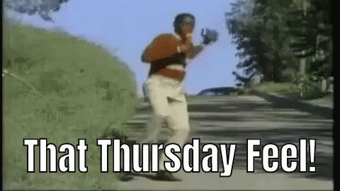
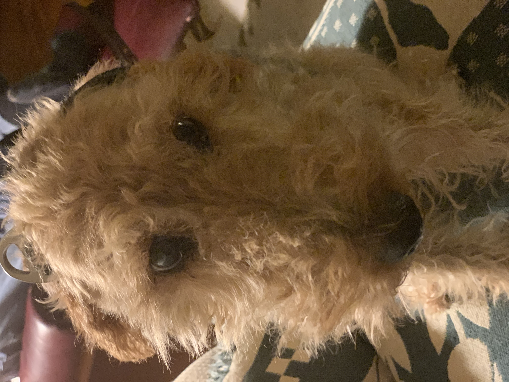
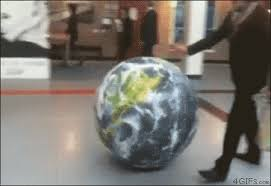
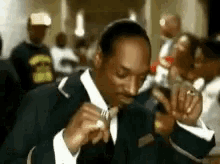
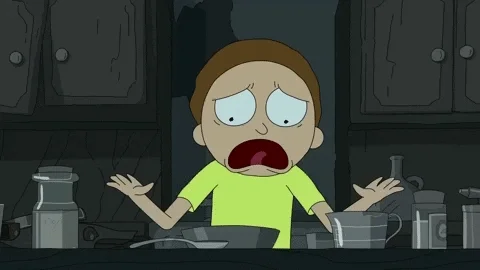
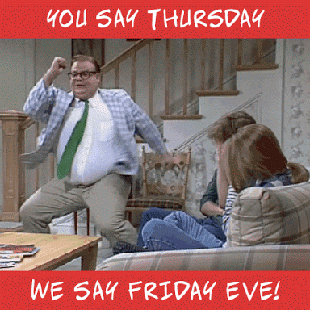
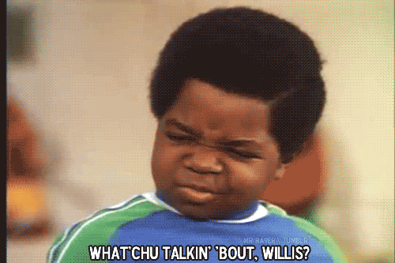
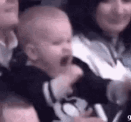
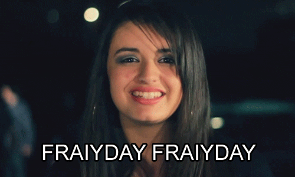
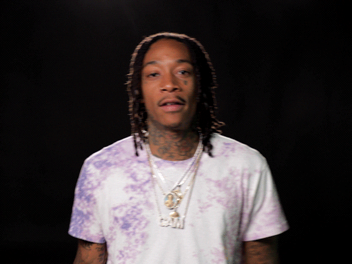

# DC DS 111819 Mod 1 Gifs

## Instructions

1. Find a Gif or image that summarizes how you're feeling about today being THURSDAY, and download that image (put your name on the image-- andy.jpg or andy.gif!)
1. In a **branch**, add your gif or image to the `images/` directory and embed the image using Markdown in this document.  I've provided an example below!
1. Commit your changes and push your branch back up to the remote (Github.com).
1. Last, issue a pull request for me (Andy) to review using the Github.com interface.

### Andy

### Anesu
Your image here!

### Nate

### Laurent
 

### Justin

### Jeff

### Raj
Your image here!

### Jill

### Andrew

### Stephen
Your image here!

### Alex C

### Nick

### Nick2

### Akshay
Your image here!

### Muoyo

### Stu

### Alex K

### Nimu

### Michael
Your image here!

### Donna
Your image here!

### Aaron

### VJ
Your image here!

### Trey
Your image here!

### Chuck
Your image here!

### Darian

